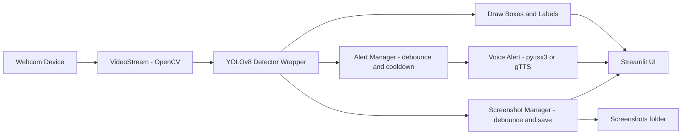

# Architecture

## Data Flow

## Module Responsibilities

- **`video_stream.py`** - owns the `cv2.VideoCapture` handle. Reads happen on a dedicated background thread that keeps only the most recent frame (never a queue), so camera I/O latency never blocks the main detection loop - see [docs/performance.md](performance.md#1-threaded-camera-capture-higher-fps-appropriate-use-of-threading). Raises `CameraNotAvailableError` if the camera can't be opened (including a low-level `cv2.error` during construction itself, e.g. a permission-denied device), and again from `read_frame()` if the camera stops producing frames for more than `CAMERA_DISCONNECT_TIMEOUT_SECONDS` mid-session - without this, a disconnected camera would silently freeze on the last good frame forever instead of surfacing an error. `release()` always stops and joins the reader thread before releasing the capture handle.
- **`detector.py`** - wraps `ultralytics.YOLO`. Loads weights once at construction (delegating to `model_downloader.ensure_weights` first, and raising `ModelLoadError` if that fails), runs one warm-up inference so the first live frame isn't the slow one, and exposes `predict(frame) -> list[Detection]`, filtering by confidence and normalizing raw model class names (`with_mask`, `without_mask`, ...) into a small stable label set via `config.CLASS_NAME_MAP`. Wraps unexpected inference/parsing failures in `FrameProcessingError`. Auto-selects the fastest available device (CUDA → Apple Silicon MPS → CPU) and enables FP16 on CUDA for real-time throughput.
- **`model_downloader.py`** - makes `MaskDetector()` work with zero manual setup: if weights aren't on disk, tries `MODEL_URL` (direct link) then a default Hugging Face Hub repo, raising `ModelLoadError` with concrete next steps only if both fail. Directory creation and file writes along every one of those paths are wrapped individually so a `PermissionError` (e.g. a read-only `models/` folder) produces a specific, actionable message instead of a generic failure or an unhandled crash.
- **`alerts/voice_alert.py`** - two interchangeable TTS backends (`pyttsx3` offline, `gTTS` online) behind one `VoiceAlertBackend.speak(text)` interface, so `AlertManager` never needs to know which one is active.
- **`alerts/alert_manager.py`** - decides *when* to actually fire an alert: enforces a cooldown so a sustained no-mask detection doesn't spam text-to-speech every frame, and degrades to on-screen-only alerts if the voice backend raises `VoiceAlertError`.
- **`screenshot.py`** - `ScreenshotManager` saves the annotated frame to `Screenshots/` (created on demand) the moment a no-mask detection occurs, using the same cooldown pattern as `AlertManager` (via the shared `utils/cooldown.Cooldown`) so a sustained no-mask streak writes at most one file per cooldown window. Filenames are timestamped (`no_mask_<date>_<time>.jpg`); save errors (permission denied, disk full, an unsupported frame via `cv2.error`) are logged and skipped rather than crashing the loop, and recorded in `last_error`/`pop_last_error()` so `app.py` can show a one-time, friendly toast instead of staying silent or repeating the same warning every frame.
- **`utils/cooldown.py`** - a small thread-safe "fire at most once per N seconds" timer, composed by both `AlertManager` and `ScreenshotManager` so the debounce logic lives in exactly one tested place. Also exposes `set_seconds()`, letting a cached manager's cooldown be changed in place without recreating it (see [docs/performance.md](performance.md#5-fixed-a-resource-cache-memory-leak-in-apppy)).
- **`utils/drawing.py`** - pure functions for drawing bounding boxes/labels, plus `bgr_to_pil()` for callers that specifically need a PIL image. `app.py`'s live video feed does *not* use `bgr_to_pil()` - it passes the BGR array straight to `st.image(..., channels="BGR")` to skip that conversion in the hot per-frame path.
- **`utils/fps.py`** - `FPSCounter` (rolling-average FPS, backed by a fixed-size `deque`) and `FrameRateLimiter` (paces the loop to `config.TARGET_FPS`, capping CPU usage on hardware faster than that target).
- **`utils/exceptions.py`** / **`utils/logger.py`** - the shared error and logging vocabulary every other module builds on.
- **`app.py`** - Streamlit UI. Wires everything above together, owns the per-frame loop, and is the last line of defense: it catches each module's specific exceptions and shows a friendly message instead of letting the whole app crash.

## Why Local-Only Webcam Access

`cv2.VideoCapture(0)` opens the camera **of the machine the Python process is running on**. When you run this app on your own laptop, that's your webcam - exactly what you want for a live demo. If this app were deployed to a cloud host (e.g. Streamlit Community Cloud), `cv2.VideoCapture(0)` would try to open a camera *on the cloud server*, which doesn't exist - it would not give a visitor's browser access to their own webcam.

That's an intentional, scoped-out tradeoff for v1 (see the roadmap's Phase 7). A real browser-based cloud deployment would need `streamlit-webrtc` (or similar) to stream video from the visitor's browser to the server over WebRTC - a meaningfully larger dependency and threading model, deferred until/unless it's actually needed.

This limitation applies equally to every cloud host, not just Streamlit Community Cloud - see [docs/deployment.md](deployment.md#read-this-first-the-webcam-caveat) for exactly what does and doesn't work when this app is deployed to Docker, Streamlit Community Cloud, or Render.

## Class Label Normalization

Public mask-detection datasets/weights don't agree on exact class names (`with_mask` vs `mask`, `mask_weared_incorrect` vs `mask_incorrect`, etc.). `config.CLASS_NAME_MAP` translates whatever the loaded weights call their classes into three stable internal labels - `mask`, `no_mask`, `mask_incorrect` - plus `unknown` for anything unmapped (logged as a warning rather than crashing, so swapping in a differently-labeled model degrades gracefully instead of breaking).
